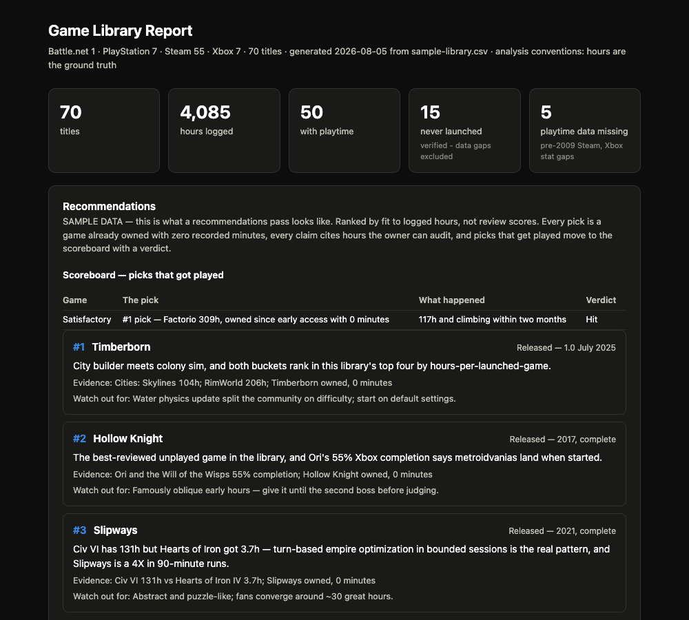
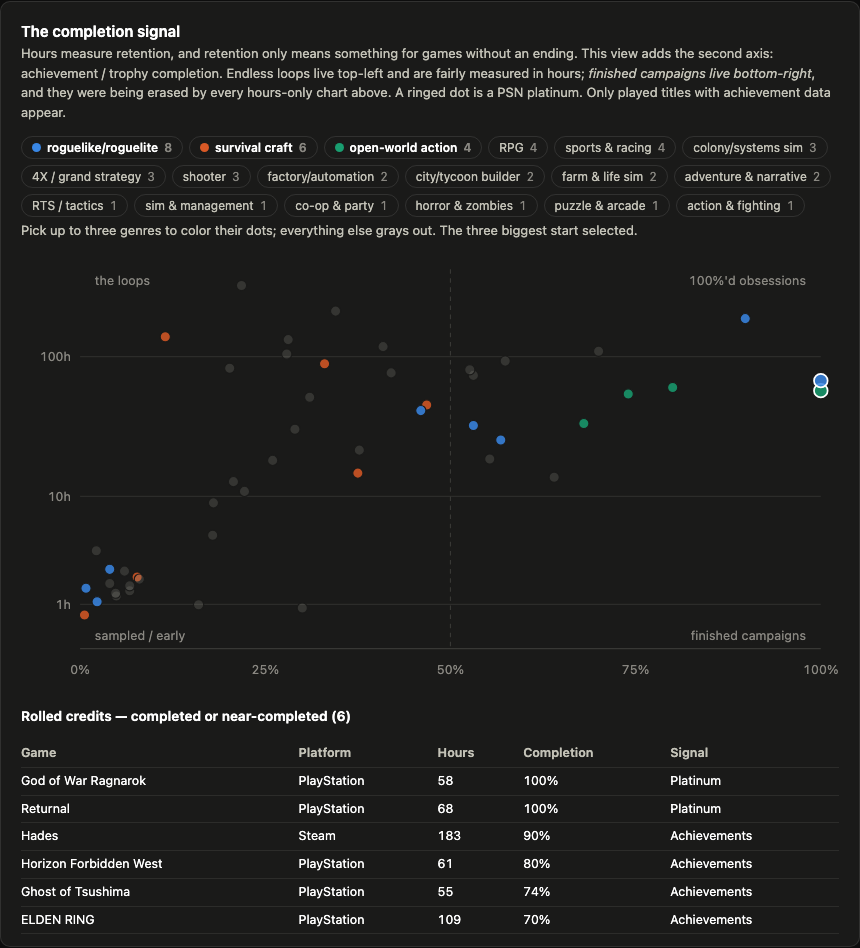
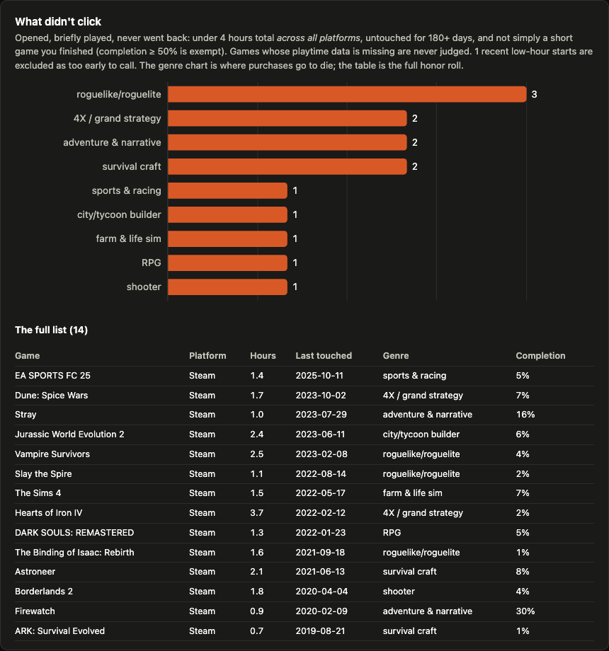

# Game Library Analysis

Pull your gaming library — Steam, Xbox, PlayStation, and the launchers with no
API at all — into one interactive report and Excel workbook, then get "what
should I play next" recommendations grounded in the hours you actually logged,
not review scores.

The premise: **people are unreliable narrators of their own taste.** You'll say
you love roguelikes when one outlier carries 90% of the genre's hours. Your
library is the ground truth. This project leads with it — including a skip list
of games your own data quietly rules out, a completion axis so finished
campaigns aren't erased by endless loops, and a scoreboard where the
recommender's own hit rate is public.



*All screenshots show the bundled [sample dataset](examples/sample-library.csv);
open the full [sample report](examples/sample-report.html) in a browser to click
around. Light mode included:*

| The completion quadrant | What didn't click |
| --- | --- |
|  |  |

This repo is packaged as a [Claude skill](https://docs.claude.com/en/docs/agents-and-tools/agent-skills):
point Claude at it (or install it) and `SKILL.md` drives the workflow. The
scripts also run standalone.

## Quick start

```bash
pip install -r requirements.txt
cp config.example.env config.env   # fill in your key(s) - config.env is gitignored
python run.py
```

`run.py` fetches every platform you gave it credentials for, merges them into
one normalized CSV, and produces two outputs in `data/`:

- **`library.xlsx`** — the analysis workbook (below)
- **`report.html`** — a self-contained interactive dashboard: headline stats,
  hours by genre, the hours-per-launched-game concentration signal, top 20
  titles, a recency scatter, and played-vs-never-launched by genre. No CDNs,
  works offline, light and dark mode.

Re-run any time to refresh; `python run.py --no-fetch` rebuilds outputs from
the existing CSV without touching the network. The individual scripts in
`scripts/` still run standalone if you prefer.

### The workbook

Four sheets:

| Sheet | Contents |
| --- | --- |
| Summary | Counts and hours by genre — all live formulas |
| Recommendations | Ranked picks, written by hand from the analysis (see SKILL.md) |
| Library | Every title by hours, with a Status column for you to fill in |
| Backlog | Zero-playtime titles, with pre-2009 untracked ones split out |

Yellow-filled, blue-font cells are yours to fill in; the Summary formulas
follow your edits.

## Adding platforms

Each fetcher writes the same normalized CSV. Concatenate them (keep one header
row) and rebuild — the workbook grows a Platform column automatically.

- **Xbox** — `scripts/fetch_xbox.py`, via a free [OpenXBL](https://xbl.io) key.
  Newest and least battle-tested fetcher; last-played dates are more reliable
  than hours on Xbox generally.
- **PlayStation** — `scripts/fetch_psn.py`, via the `psnawp` library
  (`pip install PSNAWP`). **Read the warnings in `config.example.env` first:**
  Sony has no official API, the NPSSO token this route needs is
  password-equivalent, and heavy unofficial API use carries a documented
  account-ban risk (a one-shot pull is very unlikely to trip it, but the call
  is yours). `references/platforms.md` covers two zero-risk alternatives.
  PSN also only reports *played* titles, so there is no PSN backlog view.
- **Battle.net, Epic, GOG, EA App, console-screen readings** — no APIs exist,
  so these go in `data/manual.csv` (schema in `manual.example.csv`), which
  `run.py` merges automatically. For WoW, the in-game `/played` command is
  exact; see `references/platforms.md`.

## Credentials policy

Keys live in `config.env`, which is gitignored and stays on your machine. The
scripts read them from there (or from environment variables) and never print,
log, or commit them. If you're running this with an AI assistant: the
assistant can run `run.py` without ever reading `config.env` — never paste a
key, NPSSO, or session token into a chat, and if you already have, regenerate
it.

## Layout

```
run.py                      one command: fetch all configured platforms, merge, build everything
config.example.env          copy to config.env and fill in - config.env is gitignored
SKILL.md                    the workflow — how to analyze, what makes recommendations trustworthy
references/platforms.md     per-platform data access routes and their tradeoffs
references/analysis.md      how to read a library: signals, confounders, framing
scripts/fetch_steam.py      Steam Web API -> normalized CSV
scripts/fetch_xbox.py       OpenXBL -> normalized CSV
scripts/build_workbook.py   normalized CSV -> Excel workbook
scripts/build_report.py     normalized CSV -> interactive HTML dashboard
assets/genres.json          name->genre lookup seeded from real tagged libraries
assets/pre2009_appids.json  Steam titles that predate playtime tracking
```

## The completion signal

Hours measure retention, which lies about finite games: a finished 100-hour
Elden Ring run isn't "less" than an endless loop game's 300 hours.
Achievements and trophies add the second axis: the report gains a
completion-vs-hours quadrant chart and a "rolled credits" list, the workbook
a Completion % column and a Completed sheet. Design and field notes in
`references/completion-signal.md`. PSN trophy data is pulled **once** and
cached locally (`data/psn_trophies.json`) — the pipeline never re-hits
Sony's unofficial API unless you delete the cache. Steam achievements
require the profile's "My profile" privacy set to Public while pulling.

## Buy me a game 🎮

If this told you something true about your own taste (or found your next
300-hour game in the pile you already own), you can say thanks:

[](https://ko-fi.com/roloc59)

**[ko-fi.com/roloc59](https://ko-fi.com/roloc59)**

No paywall, no telemetry, your data never leaves your machine either way.

## The normalized CSV

```
platform,id,name,minutes,last_played,genre,note
Steam,427520,Factorio,16637,2024-11-16,,
Steam,400,Portal,0,,,Playtime untracked (pre-2009)
```

`genre` may be blank (the builder fills it from `assets/genres.json`);
`last_played` is `YYYY-MM-DD` or empty; `minutes` is an integer.
